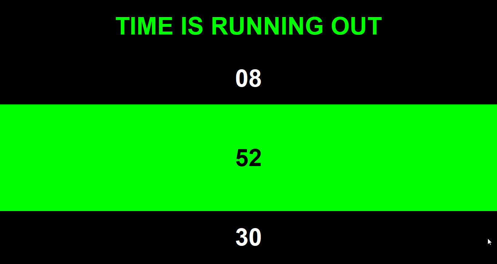
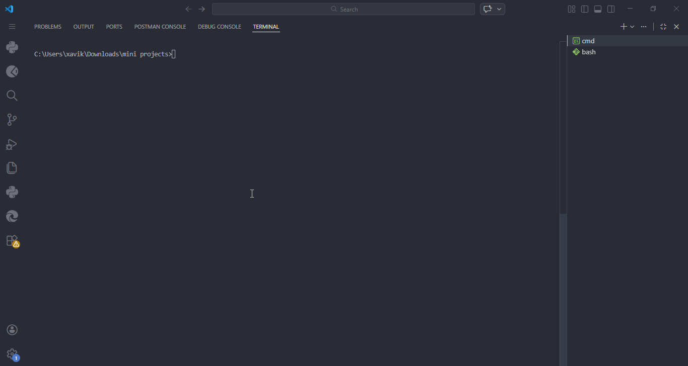

## Learning Python — Foundations & Mini Projects

#### Overview

This repository contains a structured collection of Python scripts developed while strengthening core programming fundamentals. It showcases hands-on practice across logic building, data structures, utilities, and small console-based projects.

---

#### 🎬 Demo — Digital Clock



#### 🎬 Demo — Bet



#### Objectives

* Strengthen understanding of Python syntax and structure
* Practice problem-solving using lists, conditionals, and loops
* Explore object-oriented programming basics
* Build small functional utilities and mini projects

---

#### Repository Structure

```
Learning_Python/
│
├── fundamentals/   # Core exercises and logic practice
├── utilities/      # Functional scripts (e.g., password tools)
├── mini_projects/  # Small interactive console applications
└── README.md
```

---

#### Technologies

* Python 3.x
* Python Standard Library (e.g. time, random)

---

#### How to Run

Clone the repository:

```
git clone https://github.com/Keomadia/Learning_Python.git
cd Learning_Python
```

Run a script:

```
python mini_projects/digital_clock.py
```

---


#### Challenges & Growth

* While building these exercises, I encountered several challenges:
* Understanding nested list traversal and indexing
* Structuring small scripts into reusable functions
* Managing input validation in console applications
* Transitioning from writing scripts to writing structured programs
* Each script represents an improvement in clarity, structure, and modular thinking.

#### Key Learnings

* Data structures (lists, nested lists)
* Control flow and logical checks
* Functions and modular design
* Object-oriented programming basics
* Writing clean, readable Python code
---

##### Anyankah Keomadi
###### Author
